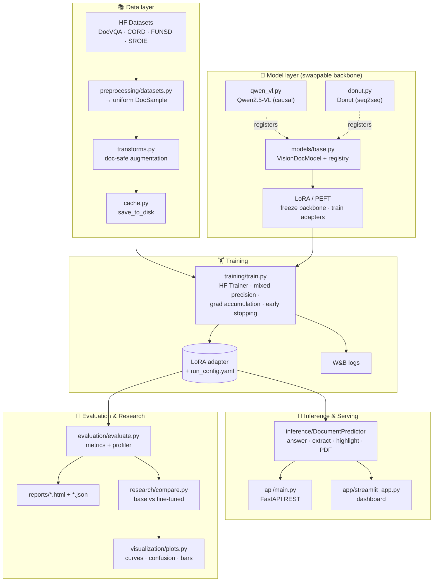

<div align="center">

# 🧾 VisionDoc AI

### Fine-Tuning a Vision-Language Model with LoRA for Document Intelligence

**Upload a document → ask questions in natural language → get answers, structured fields, confidence scores, and highlighted regions.**

Built end-to-end with PyTorch, Hugging Face Transformers, PEFT/LoRA and Qwen2.5-VL — *actual model loading, fine-tuning, evaluation and inference*, not an API wrapper.


[](https://colab.research.google.com/github/Swapnil-byte-798/visiondoc-ai/blob/main/notebooks/00_colab_quickstart.ipynb)

📘 **New to VLMs, LoRA, or any of the tools?** Read the **[From-Scratch → Advanced Study & Interview Guide](docs/VisionDoc_AI_Study_Guide.pdf)** — a ~127-page PDF that explains the project *and every tool it uses* from zero, with a full interview-question bank.

</div>

---

## 📌 Overview

**VisionDoc AI** is a research-grade, production-structured system that fine-tunes an open-source
**Vision-Language Model (VLM)** — [Qwen2.5-VL](https://huggingface.co/Qwen/Qwen2.5-VL-3B-Instruct) by
default — to understand documents (invoices, receipts, forms, ID cards, and PDFs) and answer questions
about them.

Instead of full fine-tuning (which for a 3B-parameter multimodal model needs many GPUs), we use
**LoRA / PEFT** to train a tiny set of low-rank adapter matrices while the pretrained backbone stays
**frozen**. This trains **< 1%** of the parameters, fits on a single consumer GPU, and preserves the
base model's general knowledge — the core engineering idea the project is built to demonstrate.

The whole codebase is **backbone- and dataset-agnostic**: switching from Qwen2.5-VL to Donut, or from
DocVQA to CORD, is a **one-line change in a YAML config** — no code edits.

### What it does

| Capability | Where |
|---|---|
| 📤 Accept uploaded document images **and PDFs** | `inference/`, `app/`, `api/` |
| ❓ Answer natural-language questions about a document | `POST /ask`, dashboard |
| 🧩 Extract structured fields (invoice/receipt/ID/form) | `POST /extract`, `inference/extract.py` |
| 📈 Produce calibrated **confidence scores** | `models/base.py` (token log-probs) |
| 🔦 **Highlight** the document regions behind an answer | OCR grounding, `utils/ocr.py` |
| 🔬 Compare **base vs LoRA fine-tuned** models | `research/compare.py` |
| 📊 Full evaluation pipeline (EM, ANLS, F1, BLEU, ROUGE, latency, VRAM) | `evaluation/` |

---

## 🏗️ Architecture



**Design principles**

- **One config to rule them all.** Every script is driven by a single typed `ProjectConfig`
  (`configs/config.py`) loaded from YAML. Unknown keys fail *loudly* at load time.
- **A single model contract.** Training, evaluation, inference, the API, the app, and the research
  harness all talk to one `VisionDocModel` interface — never to Qwen or Donut directly.
- **A single sample schema.** Dataset loaders emit `DocSample`; model adapters consume it. Neither
  side knows the other's raw format.
- **Runs everywhere.** Device/precision are resolved centrally (`utils/device.py`): CUDA for real
  training, Apple **MPS** or **CPU** for the demo/tests, with graceful fallback.

---

## 📂 Project structure

```
visiondoc-ai/
├── configs/          # Typed config schema (dataclasses) + YAML presets
├── data/             # (gitignored) raw / processed / cached datasets
├── preprocessing/    # Dataset loaders, doc-safe augmentation, caching, torch Dataset
├── models/           # VisionDocModel interface + Qwen2.5-VL & Donut backbones + LoRA/quant/ONNX
├── training/         # HF Trainer wrapper, callbacks (early-stop, GPU mem), train.py entrypoint
├── evaluation/       # Metrics (EM/ANLS/F1/BLEU/ROUGE), latency+VRAM profiler, HTML reports
├── inference/        # DocumentPredictor (QA, extraction, highlighting, PDF, batch)
├── research/         # Base vs LoRA comparison → tables + graphs
├── visualization/    # Loss/metric curves, confusion matrix, confidence dist., attention, comparison
├── api/              # FastAPI: POST /predict /ask /extract · GET /health
├── app/              # Streamlit dashboard
├── utils/            # logging · device/GPU · seeding · image/PDF I/O · OCR fallback
├── notebooks/        # Dataset exploration · inference demo · evaluation & comparison
├── docker/           # Dockerfile + docker-compose (api + app)
├── scripts/          # download_data.py + shell entrypoints
├── tests/            # pytest suite (runs without a GPU)
├── requirements.txt · pyproject.toml · Makefile · README.md
```

---

## ⚙️ Installation

> **Hardware.** Real LoRA fine-tuning of Qwen2.5-VL-3B needs an NVIDIA GPU (≈ 12–24 GB VRAM with
> 4-bit QLoRA / bf16). Inference, the dashboard, the API, and the tests also run on **Apple Silicon
> (MPS)** or **CPU** — just slower. The code detects and adapts to whatever is available.

```bash
git clone https://github.com/Swapnil-byte-798/visiondoc-ai.git
cd visiondoc-ai

python -m venv .venv && source .venv/bin/activate      # Python 3.11+
make install            # pip install -r requirements.txt && pip install -e .
# or: make install-dev  # adds pytest / ruff / black / mypy / jupyter
```

For a CUDA build of PyTorch matching your driver:

```bash
pip install torch torchvision --index-url https://download.pytorch.org/whl/cu124
```

Optional system tools: **tesseract-ocr** (region highlighting fallback) and **poppler-utils** (PDF).
Copy `.env.example` → `.env` to configure W&B, Hugging Face token, and paths.

---

## ▶️ Run on Google Colab (free GPU)

No local GPU? Run the full **train → evaluate → infer** loop on a free Colab **T4**:

[](https://colab.research.google.com/github/Swapnil-byte-798/visiondoc-ai/blob/main/notebooks/00_colab_quickstart.ipynb)

1. Click the badge → **Runtime → Change runtime type → T4 GPU**.
2. Run the cells top to bottom. The notebook clones the repo, installs deps (reusing
   Colab's CUDA PyTorch), and fine-tunes with **4-bit QLoRA** using
   [`configs/colab_t4.yaml`](configs/colab_t4.yaml) — tuned for the T4 (fp16, not bf16;
   small `max_pixels`; a fast CORD slice) so the whole loop runs in ~10–15 min.

The same config also works from a terminal on any CUDA box:

```bash
python -m training.train  --config configs/colab_t4.yaml
python -m evaluation.evaluate --config configs/colab_t4.yaml --adapter outputs/qwen2_5vl-cord-lora-colab/adapter --split test
```

To target **DocVQA** instead of CORD, copy `configs/colab_t4.yaml` and set
`data.dataset_name: docvqa` / `dataset_id: lmms-lab/DocVQA` / `dataset_subset: DocVQA`.

---

## 📚 Dataset

Datasets are **downloaded automatically** from the Hugging Face Hub and normalized into `DocSample`s.

| Name | Hub id | Task | Status |
|---|---|---|---|
| **CORD** *(benchmarked)* | `naver-clova-ix/cord-v2` | Receipt field extraction | ✅ **The published run** — `configs/benchmark_cord.yaml` (train 800 / val 100 / test 100) |
| DocVQA | `lmms-lab/DocVQA` | Document VQA | ⚠️ **Eval-only** — this Hub repo ships `validation` + `test` only (**no `train` split**), so it cannot be fine-tuned as configured. Not yet benchmarked. |
| FUNSD | *(not wired)* | Form understanding | ❌ Loader exists, but no `dataset_id` is configured anywhere — not runnable as-is |
| SROIE | *(not wired)* | Key-information extraction | ❌ Loader exists, but no `dataset_id` is configured anywhere — not runnable as-is |

```bash
make download                       # download + split + cache the configured dataset
make preprocess                     # build + cache the processed DatasetDict
# override the dataset/model without editing code:
make download CONFIG=configs/cord_qwen.yaml
```

Splits are **train / validation / test**; when a dataset lacks a native split we carve one
deterministically from the seed.

---

## 🏋️ Training

```bash
make train                          # LoRA fine-tune with the default config
python -m training.train --config configs/default.yaml
python -m training.train --resume outputs/qwen2_5vl-docvqa-lora/checkpoint-500   # resume
```

Implemented (all configurable in YAML): **LoRA adapter training with a frozen backbone**, mixed
precision (bf16/fp16), **gradient accumulation**, **gradient checkpointing**, cosine LR schedule with
warmup, **early stopping**, best-checkpoint selection, checkpoint saving + resume, **W&B logging**, and
automatic **GPU detection**. Only the answer tokens contribute to the loss (the prompt is masked).

After training you get `outputs/<run>/adapter/` (the LoRA weights) and `run_config.yaml` (the exact
config used — for reproducibility).

---

## 🔎 Inference

**Python**

```python
from configs import load_config
from inference import DocumentPredictor

predictor = DocumentPredictor.from_config(load_config("configs/default.yaml"))

res = predictor.answer("samples/invoice.png", "What is the total amount due?")
print(res.answer, res.confidence)          # e.g. "$1,240.00", 0.92

fields = predictor.extract("samples/receipt.jpg", doc_type="receipt")
print(fields["fields"])                     # {"merchant": ..., "date": ..., "total": ...}
```

**REST API** (FastAPI)

```bash
make api            # uvicorn api.main:app --port 8000   → docs at /docs
```

| Endpoint | Body | Returns |
|---|---|---|
| `GET /health` | – | model/device status |
| `POST /ask` | `{image_base64, question}` | answer + confidence + regions |
| `POST /extract` | `{image_base64, doc_type?, fields?}` | structured fields |
| `POST /predict` | multipart `file` + `question` | answer + confidence |

**Dashboard** (Streamlit)

```bash
make app            # streamlit run app/streamlit_app.py   → http://localhost:8501
```

Upload an image/PDF, pick **Base** or **LoRA fine-tuned**, ask a question, and see the answer,
confidence meter, highlighted regions, inference time, and live GPU usage.

---

## 📊 Evaluation

```bash
make evaluate                       # evaluate a checkpoint → reports/*.html + *.json
python -m evaluation.evaluate --config configs/default.yaml --adapter outputs/.../adapter
```

Computed metrics: **Exact Match**, **ANLS** (the standard DocVQA metric), token-level
**Precision / Recall / F1**, **BLEU**, **ROUGE-1/2/L**, structured-field F1, **average confidence**,
**inference latency** (mean / p50 / p90), **peak GPU memory**, and **training time**. Reports are
self-contained HTML with a metrics table and sample predictions.

---

## 🔬 Research: Base vs LoRA fine-tuned

```bash
make compare        # python -m research.compare --config configs/default.yaml
```

Evaluates the **frozen base model** and the **LoRA fine-tuned** model on the same test split and emits
`reports/comparison.csv`, `reports/comparison.md`, and a grouped bar chart.

### Results

The table below is **generated from `reports/results.json`** by `make readme` — it is never
hand-edited. CI runs `make readme-check` and **fails the build** if the committed table drifts from
the results file by a single character, so a number cannot reach this README except through a real run.

Machine-dependent figures (latency, VRAM, wall-clock training time) are deliberately **kept out** of
the checked block — they differ per runner and would either break CI or force the gate to be made
toothless. They live in `reports/results.json`.

<!-- EVAL:BEGIN -->

<!-- Written by scripts/update_readme.py from reports/results.json.
     Do not edit by hand: CI runs `--check` and fails the build when this
     block is stale or hand-edited. Machine-dependent figures (latency,
     VRAM, training wall-clock) are deliberately absent — see results.json. -->

**No evaluation run has been published yet.** `reports/results.json` does not exist in this checkout, so there are no numbers to show — and this project does not print placeholder ones.

To produce the artifact this table is generated from:

```bash
make results      # python -m research.compare --config configs/benchmark_cord.yaml --adapter outputs/.../adapter --split validation+test --max-samples 200
make readme       # regenerate this block from reports/results.json
```

Commit the resulting `reports/results.json` alongside the regenerated block. CI runs `make readme-check` and fails if the two ever disagree, so the table cannot drift from the run — and cannot be written by hand.

<!-- EVAL:END -->

**Reproduce it yourself** on a free Colab T4 (resumable across disconnects):

[](https://colab.research.google.com/github/Swapnil-byte-798/visiondoc-ai/blob/main/notebooks/01_reproduce_results.ipynb)

→ run [`notebooks/01_reproduce_results.ipynb`](notebooks/01_reproduce_results.ipynb) → commit `reports/results.json` → `make readme`.

---

## 📈 Visualization

`visualization/plots.py` generates: **loss curves**, **eval-metric curves**, **confusion matrix**,
**confidence distribution**, **attention overlay** (best-effort), **prediction samples grid**, and the
**model-comparison bar chart** — all saved as PNGs under `reports/`.

---

## 🖼️ Screenshots

> _Add screenshots after running the app (`docs/` or `assets/`):_
>
> - `assets/dashboard.png` — Streamlit dashboard with a highlighted answer
> - `assets/comparison_bars.png` — base vs fine-tuned metrics
> - `assets/loss_curve.png` — training/validation loss

---

## 🐳 Docker

```bash
make docker-build                   # build the image
make docker-up                      # api :8000  +  streamlit :8501
```

`docker/docker-compose.yml` runs the API and dashboard from one image; a commented GPU block enables
NVIDIA runtime for training. See `docker/README.md`.

---

## ✨ Bonus features

- **Quantization** — 4-bit **QLoRA** for training (`models/quantization.py`) + CPU dynamic quantization.
- **ONNX export** — best-effort export path with honest caveats (`models/onnx_export.py`).
- **Batch inference** — run a whole folder of images/PDFs (`inference/batch.py`).
- **PDF support** — automatic rasterization (`utils/image_utils.pdf_to_images`).
- **OCR fallback** — Tesseract-based grounding for region highlighting (`utils/ocr.py`).
- **Model comparison page** — in both the dashboard and the research report.

---

## 🧪 Code quality

Type hints, docstrings, and design-rationale comments throughout; centralized logging; a single typed
config; clean OOP (registry + strategy pattern for backbones); modular packages; a `pytest` suite that
runs without a GPU; and `ruff` / `black` / `mypy` configured in `pyproject.toml`.

```bash
make lint && make typecheck && make test && make smoke
```

---

## 🚧 Future work

- Layout-aware grounding (train the model to emit bounding boxes natively, beyond OCR matching).
- DPO/ORPO preference tuning on human-verified extractions.
- Multi-page / long-document reasoning and table structure recognition.
- vLLM / TGI serving and a fully-supported end-to-end ONNX/TensorRT path.
- Active-learning loop over low-confidence predictions.

---

## 📄 License

MIT — see [LICENSE](LICENSE).

<div align="center"><sub>Built to demonstrate deep-learning engineering: real model loading, LoRA fine-tuning, evaluation, and inference.</sub></div>
